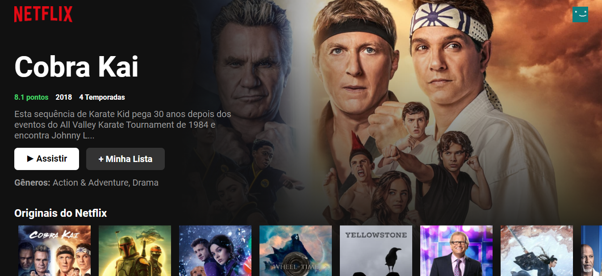

# Netflix Clone

> Clone da tela inicial do Netflix utilizando o react.

## ☕ Usando Netflix Clone

Para usar Netflix Clone, clique no link abaixo:

[![Abrir com Netlifly]](https://netflix-clone-react-gabo.netlify.app/)

## 🤝 Colaborador

Agradecemos à seguinte pessoa que contribuíu para este projeto:

<table>
  <tr>
    <td align="center">
      <a href="https://github.com/gabomoreira">
         
        
          <b>Gabriel Moreira</b>
        
      </a>
    </td>
  </tr>
</table>
